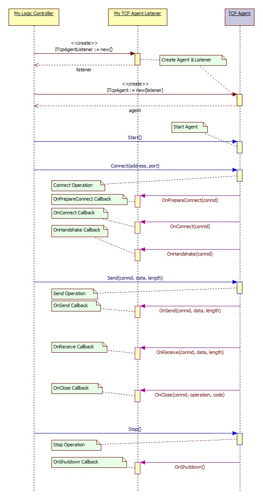

---
*High Performance Network Framework*
## Description
- ***Server*** Based on IOCP/EPOLL communication model, combined with technology of memory pool, private heap etc., efficient memory management is implemented to support large scale and high concurrent communication scenarios.
- ***Agent*** The Agent component is essentially a Multi-Client component that uses the same technical architecture as the Server component. An Agent component object can create and efficiently handle large-scale Socket connections at the same time.
- ***Client*** Based on Event-Select/POLL communication model, each component object creates a communication thread and manages a Socket connection. Client components are suitable for small-scale client scenarios.
## Document
- HP-Socket Development Guide 
[[pdf]](Doc/HP-Socket%20Development%20Guide.pdf)
- HP-Socket Class Diagram 
[[uml]](Doc/HP-Socket%20Class%20Diagram.uml)
- HP-Socket Class Diagram 
[[jpg]](Doc/HP-Socket%20Class%20Diagram.jpg)
- HP-Socket SSL Class Diagram 
[[jpg]](Doc/HP-Socket%20SSL%20Class%20Diagram.jpg)
- HP-Socket HTTP Class Diagram 
[[jpg]](Doc/HP-Socket%20HTTP%20Class%20Diagram.jpg)
## Workflow
1. Create listener object
2. Create component object (and binding with listener object)
3. Start component object
4. Connect to dest host (for *Agent* Component only)
5. process network events (*OnConnect/OnReceive/OnClose* etc.)
6. Stop component object (optional: component object will be stopped before destroy in step 7)
7. Destroy component object
8. Destroy listener object


## Example
- ***C++ Example***

``` C++
#include <hpsocket/HPSocket.h>

/* Listener Class */
class CListenerImpl : public CTcpPullServerListener
{

public:
	// 5. process network events
	virtual EnHandleResult OnPrepareListen(ITcpServer* pSender, SOCKET soListen);
	virtual EnHandleResult OnAccept(ITcpServer* pSender, CONNID dwConnID, UINT_PTR soClient);
	virtual EnHandleResult OnHandShake(ITcpServer* pSender, CONNID dwConnID);
	virtual EnHandleResult OnReceive(ITcpServer* pSender, CONNID dwConnID, int iLength);
	virtual EnHandleResult OnSend(ITcpServer* pSender, CONNID dwConnID, const BYTE* pData, int iLength);
	virtual EnHandleResult OnClose(ITcpServer* pSender, CONNID dwConnID, EnSocketOperation enOperation, int iErrorCode);
	virtual EnHandleResult OnShutdown(ITcpServer* pSender);
};

int main(int argc, char* const argv[])
{
	// 1. Create listener object
	CListenerImpl s_listener;
	// 2. Create component object (and binding with listener object)
	CTcpPullServerPtr s_pserver(&s_listener);
	
	// 3. Start component object
	if(!s_pserver->Start("0.0.0.0", 5555))
		exit(1);
	
	/* wait for exit */
	// ... ... 
	
	// 6. (optional) Stop component object
	s_pserver->Stop();

	return 0;
	
	// 7. Destroy component object automatically
	// 8. Destroy listener object automatically
}
```

- ***C Example***

``` C
#include <hpsocket/HPSocket4C.h>

// 5. process network events
EnHandleResult __HP_CALL OnConnect(HP_Agent pSender, HP_CONNID dwConnID);
EnHandleResult __HP_CALL OnReceive(HP_Agent pSender, HP_CONNID dwConnID, int iLength);
EnHandleResult __HP_CALL OnSend(HP_Agent pSender, HP_CONNID dwConnID, const BYTE* pData, int iLength);
EnHandleResult __HP_CALL OnClose(HP_Agent pSender, HP_CONNID dwConnID, En_HP_SocketOperation enOperation, int iErrorCode);
EnHandleResult __HP_CALL OnShutdown(HP_Agent pSender);

int main(int argc, char* const argv[])
{
	HP_TcpPullAgentListener s_listener;
	HP_TcpPullAgent s_agent;

	// 1. Create listener object
	s_listener = ::Create_HP_TcpPullAgentListener();
	// 2. Create component object (and binding with listener object)
	s_agent    = ::Create_HP_TcpPullAgent(s_listener);
	
	/* Set listener callbacks */
	::HP_Set_FN_Agent_OnConnect(s_listener, OnConnect);
	::HP_Set_FN_Agent_OnSend(s_listener, OnSend);
	::HP_Set_FN_Agent_OnPullReceive(s_listener, OnReceive);
	::HP_Set_FN_Agent_OnClose(s_listener, OnClose);
	::HP_Set_FN_Agent_OnShutdown(s_listener, OnShutdown);
	
	// 3. Start component object
	if(!::HP_Agent_Start(s_agent, "0.0.0.0", TRUE))
		exit(1);
	
	// 4. Connect to dest host
	::HP_Agent_Connect(s_agent, REMOTE_HOST_1, REMOTE_PORT_1, nullptr);
	::HP_Agent_Connect(s_agent, REMOTE_HOST_2, REMOTE_PORT_2, nullptr);
	::HP_Agent_Connect(s_agent, REMOTE_HOST_3, REMOTE_PORT_3, nullptr);
	
	/* wait for exit */
	// ... ... 
	
	// 6. (optional) Stop component object
	::HP_Agent_Stop(s_agent);

	// 7. Destroy component object
	::Destroy_HP_TcpPullAgent(s_agent);
	// 8. Destroy listener object
	::Destroy_HP_TcpPullAgentListener(s_listener);
	
	return 0;
}
```

## Component List
- ***Basic Components***


- ***SSL Components***


- ***HTTP Components***


## Reference Projects

- *[mimalloc](https://github.com/microsoft/mimalloc)*
- *[jemalloc](https://github.com/jemalloc/jemalloc)*
- *[openssl](https://github.com/openssl/openssl)*
- *[llhttp](https://github.com/nodejs/llhttp)*
- *[zlib](https://github.com/madler/zlib)*
- *[brotli](https://github.com/google/brotli)*
- *[kcp](https://github.com/skywind3000/kcp)*

## Extension Projects

- *[HP-Socket for MacOS](https://gitee.com/xin_chong/HP-Socket-for-macOS)*
- *[HP-Socket for .Net](https://gitee.com/int2e/HPSocket.Net)*

## Technical Exchange Groups

- *[QQ Group - 1](https://jq.qq.com/?_wv=1027&k=3UAbrhTG)*
- *[QQ Group - 2](https://jq.qq.com/?_wv=1027&k=uYBpc6bG)*